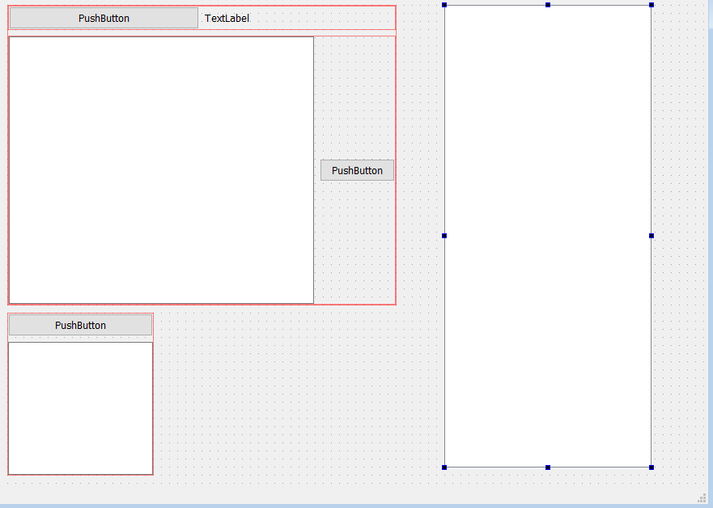

# Техническое задание

1. Project name: менеджер паролей
2. Authors:
- Team lead: Советов Егор
- project: Советов Егор
- teacher: Анатольев Алексей Владимирович
3. Description of the program.
> программа менеджер паролей, она будет обладать рядом инструментов для создания, проверки и сохранения паролей;

> сразу после запуска пользователь видит таблицу со всеми командами программы
 
> - главная форма со строками ввода и вывода паролей
> - дополнительная форма для сохранения паролей
> - список сохраненных паролей

> - кнопка для генерации пароля
> - строка ввода пароля, ниже кнопка проверки пароля

> два диалоговых окнв для сохранения собственного пароля

> бд с сохраненными паролями пользователя

> при выходе из программы, не происходит дополнительных действий 
4. Progect description:
в первом окне пользователь может сгенерировать пароль, подходящий по критериям безопасности, а именно:
 - длина более 8 букв
 - наличие букв верхнего и нижнего регистра
 - буквы в пароле идут не более чем 2 подряд
 - не более 4 повторений одной и той же буквы во всем пароле
 - наличие спец. знаков – «@», «$», «&» и т.д.
 - наличие более чем 1 цифры в пароле
 - не более 20 символов в пароле
5. programm code plan: понадобится библиотека PyQt6, sql
6. graphical interface: 
7. примерное время выполнения работы: 14 дней